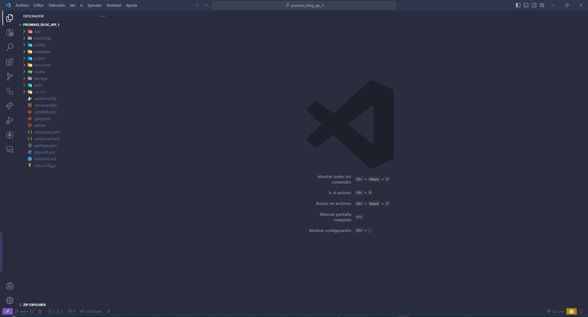

# Laravel API para blog de GRUPO PROMASS

Esta API fue desarrollada en su totalidad con Laravel 10.

<h2>Requerimientos técnicos</h2>

<ul>
    <li>Servidor Apache (puede ser WAMP o XAMPP), como alternativa puede ser NGINX.</li>
    <li>PHP versión 8.2+</li>
    <li>Composer</li>
    <li>MySQL versión 8+</li>
</ul>

<h2>Herramientas de instalación</h2>

<ul>
    <li>Git (esto es necesario para la instalación via consola de comandos).</li>
    <li>MySQL Workbench o algún otro Gestor de Base de datos (esto es necesario para la manipulación de la base de datos, si no se instala y prefieres hacerlo por consola de comandos; está bien, también es posible).</li>
</ul>

<h2>Proceso de instalación en local</h2>

<ol>
    <li>Abrir un navegador de internet e ingresar a la siguiente url: <a href='https://github.com/DarkHawk21/promass_blog_api' target="_blank">https://github.com/DarkHawk21/promass_blog_api</a>  
    </li>
    <li>Dar click en el botón verde <strong>"<>Code"</strong> y seleccionar la opción <strong>"HTTPS"</strong> para que nos aparezca la URL completa a clonar. Copiamos esa URL.  </li>
    <li>En nuestra PC abrimos una terminal y nos dirigimos a la carpeta en donde queremos que se descargue nuestro proyecto, en este caso será dentro de la carpeta "WWW" de WAMP (en Windows), ya que es ahí desde donde se muestran los proyectos locales en Apache. <strong>Si tienes un servidor Apache individualmente, deberás clonar este proyecto dentro de la carpeta que se indique en su documentación. Por otro lado, si tienes linux como Sistema Operativo, debes ir a la carpeta /var/www/html.</strong>   </li>
    <li>Clonamos el proyecto desde Github con la URL que obtuvimos en el paso 2. Esto lo hacemos con el comando <code>git clone https://github.com/DarkHawk21/promass_blog_api.git</code>.  </li>
    <li>Nos dirigimos a la carpeta del proyecto con el comando <code>cd promass_blog_api</code> e instalamos todos los paquetes necesarios con el comando <code>composer install</code>.      </li>
    <li>En nuestra PC, abrimos MySQL Workbench o la herramienta de Gestión de base de datos que estés utilizando y configuramos una nueva conexión a nuestro servidor de MySQL.        </li>
    <li>Creamos una base de datos para nuestra API, con el comando  <code>CREATE DATABASE promass_blog_api;</code>  </li>
    <li>Una vez creada nuestra base de datos, abrimos nuestro editor de código favorito (en este caso será Visual Studio Code) y seleccionamos la carpeta de nuestro proyecto.  </li>
    <li>Creamos un nuevo archivo llamado <strong>.env</strong> y copiamos dentro el contenido del archivo <strong>.env.example</strong>  </li>
    <li>Configuramos la conexión a nuestra base de datos creada en el punto 7.  </li>
    <li>Corremos migraciones y seeders para crear y poblar nuestra base de datos con Laravel, esto lo hacemos con el comando <code>php artisan migrate:fresh --seed</code>.  </li>
    <li>Regresamos a nuestra terminal, si estás en VS Code puedes abrirla directamente desde ahí para que automáticamente te dirija a la ruta del proyecto. Escribimos el comando <code>php artisan key:generate</code> para que Laravel nos cree nuestro TOKEN de aplicación.  </li>
    <li>En la misma terminal, escribimos el comando <code>php artisan jwt:secret</code> para que Laravel con JWT nos cree nuestro TOKEN para autenticación.  </li>
    <li>En la misma terminal, escribimos el comando <code>php artisan serve</code> para que Laravel inicie el servidor local desde donde podremos ver y usar la API.  </li>
    <li>Para comprobar que la API está en línea podemos abrir nuestro navegador favorito y dirigirnos a la ruta <a href="http://127.0.0.1:8000" target="_blank">http://127.0.0.1:8000</a>.  </li>
</ol>

<h2>API Test</h2>

La API cuenta con una colección de <a href="https://www.postman.com/" target="_blank">POSTMAN</a> que nos permite conocer todos los endpoints que tiene disponibles, así como probar cada uno de ellos y saber qué necesito para poder usarlos.

Para descargar la colección solo necesitas ir <a href="https://github.com/DarkHawk21/promass_blog_api/blob/main/README/postman/Promass_blog_api.postman_collection.json" target="_blank">aquí</a>.

